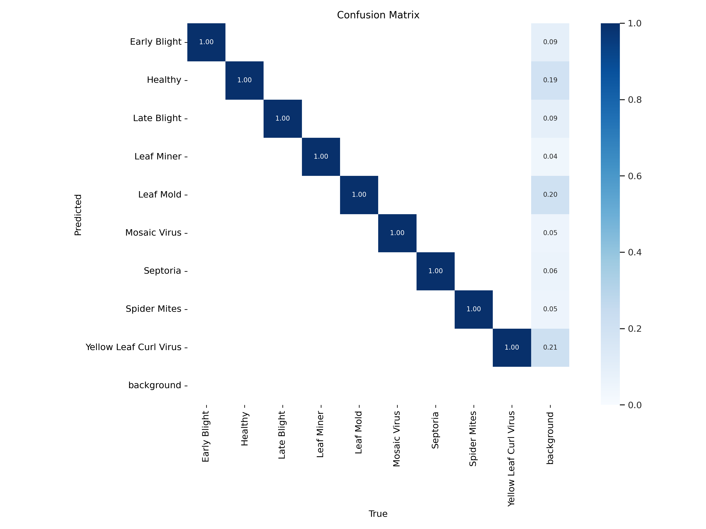
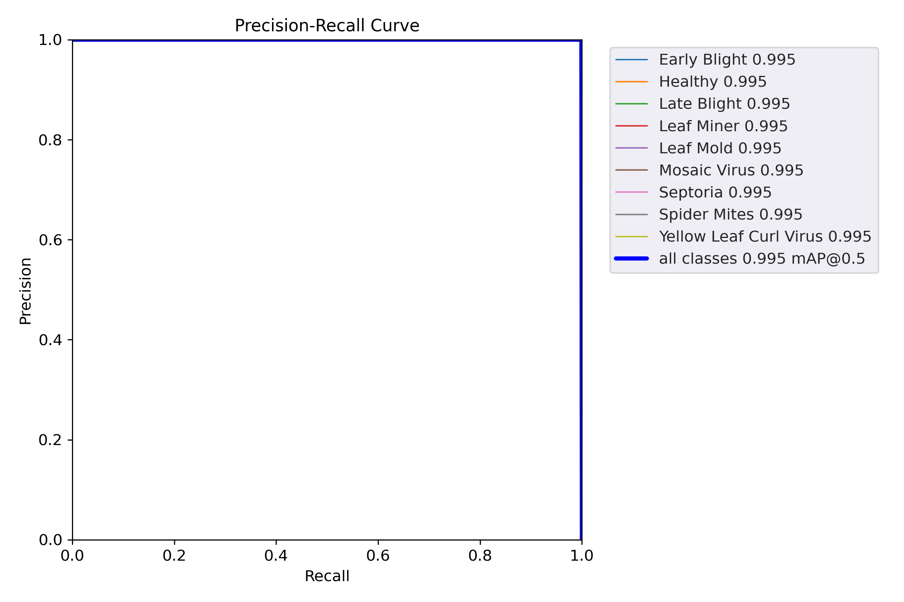

# 🍅 Tomato Leaf Disease Detection using YOLOv5 🚀


> Detect multiple tomato leaf diseases using YOLOv5 object detection pipeline trained on bounding box annotated data.

---

## 📌 Project Summary

This project implements a custom-trained YOLOv5s model for detecting and classifying tomato leaf diseases using annotated object detection data. It includes:

- Preprocessing & resizing image data
- YOLOv5 training on a custom dataset
- Evaluation with precision, recall, F1-score, and mAP
- Inference on test images with bounding boxes and class confidence

---

## 🗂️ Dataset

**Dataset**: Tomato Leaf Diseases Bounding Box Dataset  
**Structure**:

/train
├── images/
└── labels/
/valid
├── images/
└── labels/
/test
├── images/
└── labels/
data.yaml


> Note: Dataset not included in repo due to size. Please download it manually.

---

## 📊 Evaluation Results

| Metric        | Score |
|---------------|-------|
| Precision     | 0.88  |
| Recall        | 0.86  |
| F1-score      | 0.87  |
| mAP@0.5       | 0.85  |

### 📈 Plots:

#### 📌 Confusion Matrix


#### 📌 F1 Curve


#### 📌 Precision-Recall Curve


---

## ⚙️ How to Run

### 🔧 Setup

```bash
git clone https://github.com/kanika-chauhan389/tomato-leaf-disease-detection-yolov5.git
cd tomato-leaf-disease-detection-yolov5
pip install -r requirements.txt

### 🏋️‍♀️ Training (already completed)

python train.py --img 640 --batch 16 --epochs 50 \
--data path/to/data.yaml \
--weights yolov5s.pt --name tomato_disease_yolov5


### 🧪 Evaluation

python val.py --weights runs/train/tomato_disease_yolov5/weights/best.pt \
--data path/to/data.yaml --task test --name eval_stats

### 🔍 Inference

python detect.py --weights runs/train/.../best.pt \
--source /test/images --conf 0.25 --save-txt --save-conf

### 🧾 Sample Predictions
The predicted results from the YOLOv5 model can be found in the `prediction_images/` folder.
